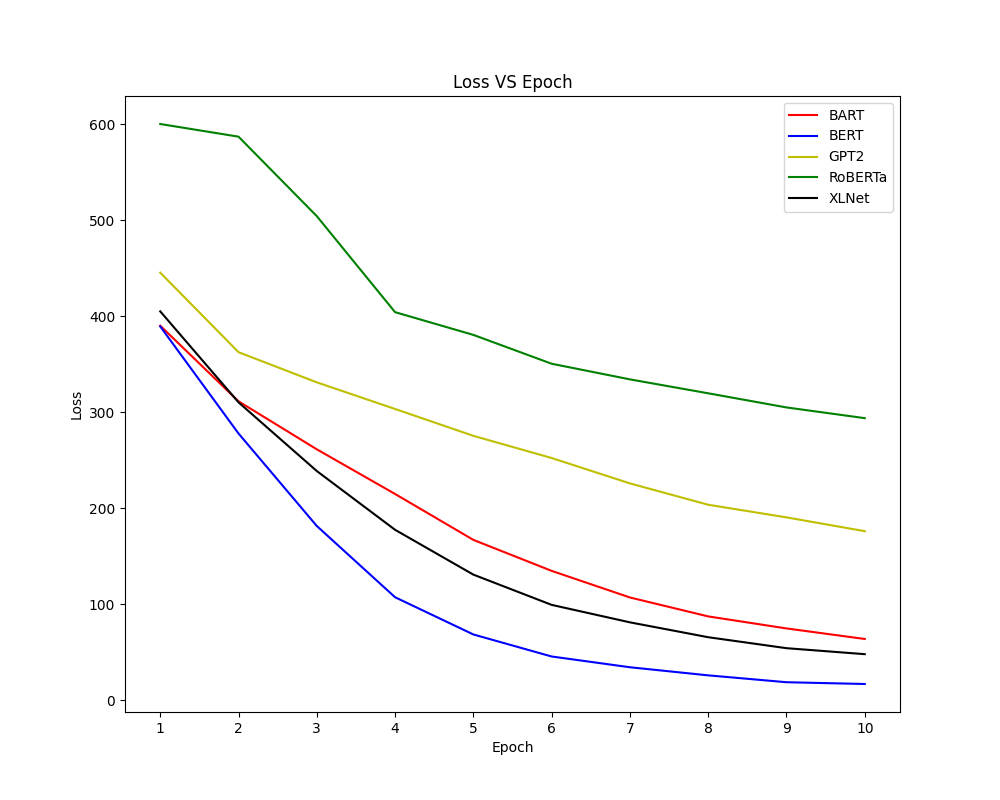

# Disaster Tweet Classification

## Requirements

- Python >= 3.6
- Pytorch (with specific cuda version) ([official website](https://pytorch.org/get-started/locally/))
- Transformers (Download [here](https://github.com/huggingface/transformers))
- tqdm

## Contents

Folder `data` contains three `.csv` files, training, test and validation.

Other folders contain a dataset class file and three result files generated by the `main.py`.

Use package `pickle` to load the `.p` file and `torch` to load model.

```
import pickle
import torch

with open('bert_loss.p', 'rb') as f:
    bert_loss = pickle.load(f)

model = torch.load('bert_model.pt')
```

## Usage

Run the following command to train a certain model and get the loss, accuracy on the validation and test dataset.

```
$ python main.py [--train path] [--test path] [--validation path] [--epoch n] [--model name]
```

The default values:

- train: data/disaster_response_messages_training.csv
- test: data/disaster_response_messages_test.csv
- validation: data/disaster_response_messages_validation.csv
- epoch: 10
- model: bert

model choices: `bart`, `bert`, `gpt2`, `roberta`, `xlnet`.

Run the following command to plot figures of loss and accuracy.

```
$ python draw_result.py
```

## Results

Loss V.S. Epoch:



Validation Accuracy V.S. Epoch:


Test Accuracy V.S. Model

